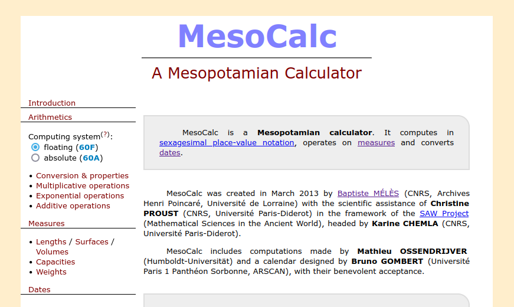
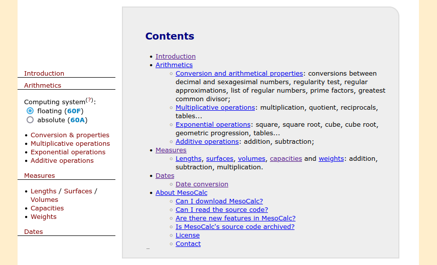
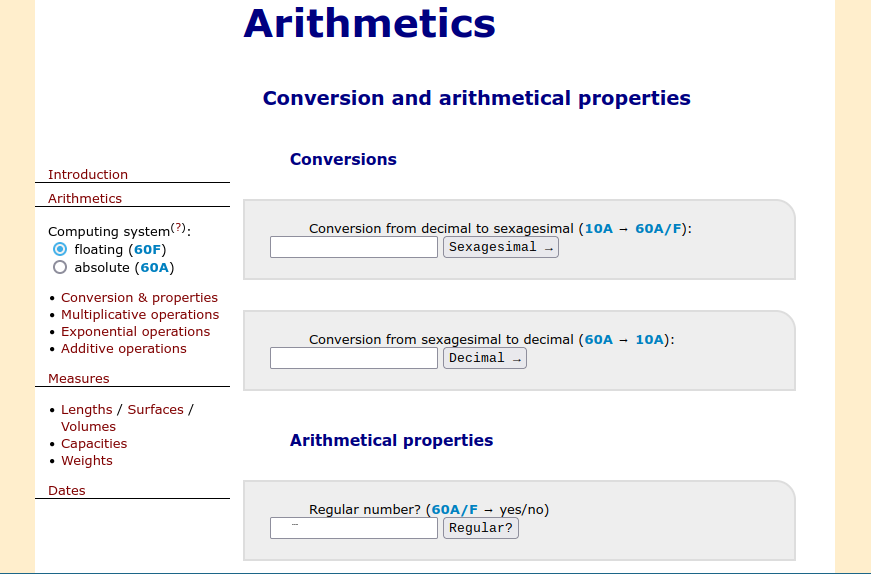
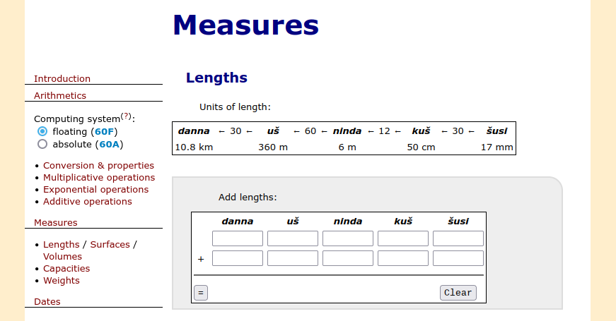
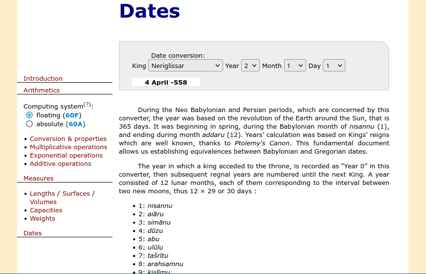
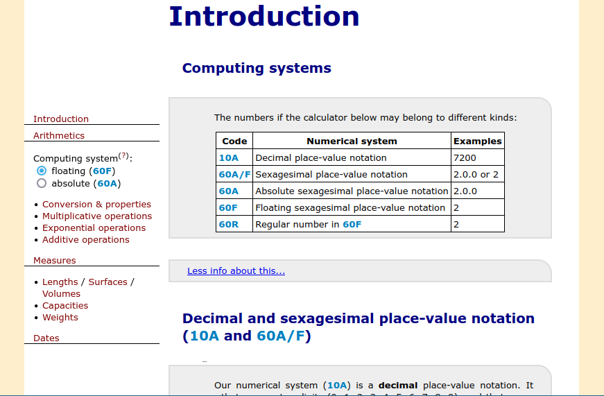

# MesoCalc: A Mesopotamian Calculator

MesoCalc is a Mesopotamian calculator. It computes in sexagesimal place-value notation, operates on measures and converts dates.

## Features

## History

MesoCalc was created in March 2013 by Baptiste Mélès (CNRS, Archives
Henri Poincaré, Université de Lorraine) with the scientific assistance
of Christine Proust (CNRS, Université Paris-Diderot) in the framework of
the SAW Project (Mathematical Sciences in the Ancient World), headed by
Karine Chemla (CNRS, Université Paris-Diderot).

MesoCalc includes computations made by Mathieu Ossendrijver
(Humboldt-Universität) and a calendar designed by Bruno Gombert
(Université Paris 1 Panthéon Sorbonne, ARSCAN), with their benevolent
acceptance.

## Installation

- **Online use**: Open [MesoCalc on Baptiste Mélès'
  website](http://baptiste.meles.free.fr/site/mesocalc.html).

- **Offline use**: Download the [`mesocalc.html`](mesocalc.html) file.

## Usage

- **Online use**: Open [MesoCalc on Baptiste Mélès'
  website](http://baptiste.meles.free.fr/site/mesocalc.html).

- **Offline use**: Open in your browser your local copy of
    [`mesocalc.html`](mesocalc.html).

## Documentation

You can either read the [included documentation](http://baptiste.meles.free.fr/site/mesocalc.html#note), or read the [PDF guide `mesocalc-tutorial.pdf`](mesocalc-tutorial.pdf).

## Contact and support

Baptiste Mélès (CNRS, Archives Henri-Poincaré—PReST, Université de Lorraine) <baptiste.meles@univ-lorraine.fr>

## Contributing

Pull requests are welcome. For major changes, please open an issue first
to discuss what you would like to change.

Please make sure to update tests as appropriate.

## License

[GPL-3.0](https://choosealicense.com/licenses/gpl-3.0/)
